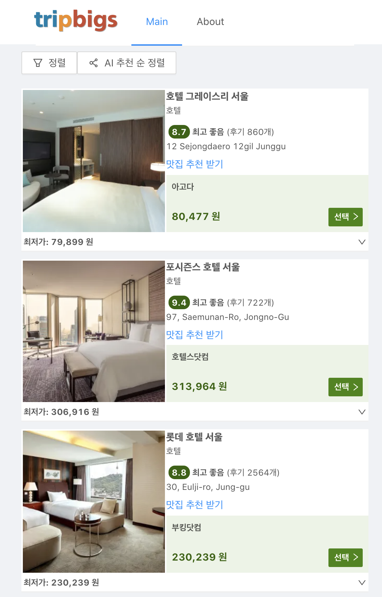
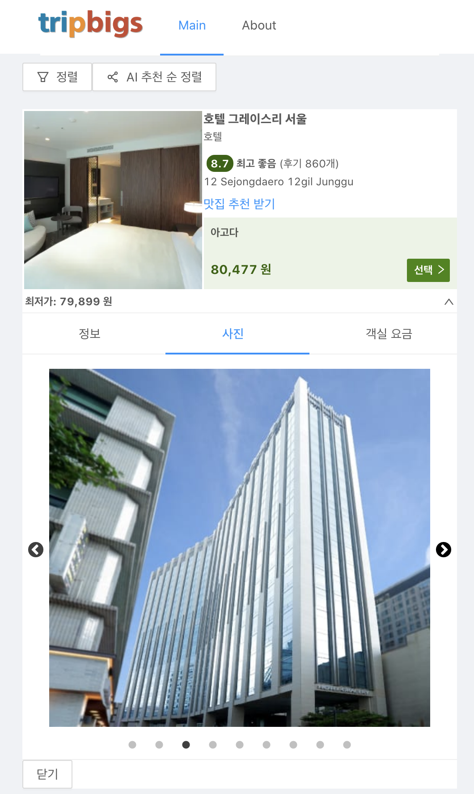
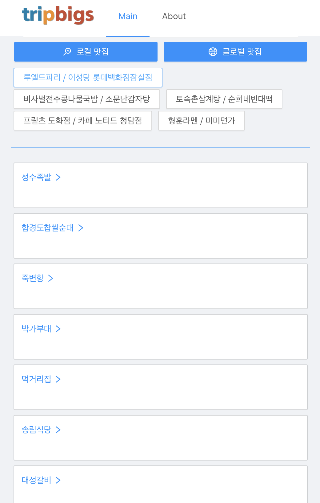

# TripBigs Web App

> 사용자의 이벤트 로그를 수집하고 이를 바탕으로 한 AI 추천순 정렬을 제공합니다. 실시간 ML 모델 서빙을 통한 실시간 추론을 제공하며, 오토인코더, 협업필터링 기반 호텔별 맛집 추천 리스트를 보여줍니다.


### **주요 기능 설명**
1. Session 기반 추천 모델은 [Boosting algorithms for session-based, context-aware recommender system in online travel domain.](https://drive.google.com/file/d/1SOoO0vBYXEpE6-1MY0MYNBvCQnQRjp5_/view) (Recsys 2019) 을 기반으로 구현되었으며 서울 데이터를 기반으로 파인튜닝 및 최적화를 진행하였습니다.
2. 호텔 기반 맛집 추천 모델은 오토인코더, 협업필터링, DeepFM, Wide&Deep 모델이 사용되었으며, 로컬 맛집과 외국인을 위한 맛집을 구분한 것이 특징입니다. 로컬 맛집의 경우 이전 히스토리를 선택할 수 있는 옵션을 제공합니다.
3. Session 기반 추천순 정렬을 이용할 시 Redux-Saga를 이용한 비동기 통신 제어를 하였으며, 전반적으로 Redux를 통한 상태관리르 구현하였습니다.

### Architecture


### 스크린샷

|Main|Info Tab|Recommendation|
|--|--|--|
||||


## Backend

- [x] ML 모델 실시간 서빙
- [x] Profiling을 통한 병목구간 탐색 및 병렬처리
- [x] 주요 파일 경량화 및 캐싱
- [x] 추론시간 180초 내외에서 3초대로 단축

## Frontend

- [x] Hotel Card Initial State 설정
- [x] Card Component 구현
- [x] Price Dummy data
- [x] Tracking Feature 구현
- [x] GA 연결 
- [x] API와 연결
- [x] Sorting 필터 구현
- [x] 맛집 추천
- [x] Router 적용

## Tracking Log

```
Action Event
## Action Type (/w hotel_id)
['interaction item image', 'clickout item', 'interaction item info',
'interaction item deals', 'interaction item rating']

## Action Type (/w filter)
[ 'filter selection', 'change of sort order']
```

